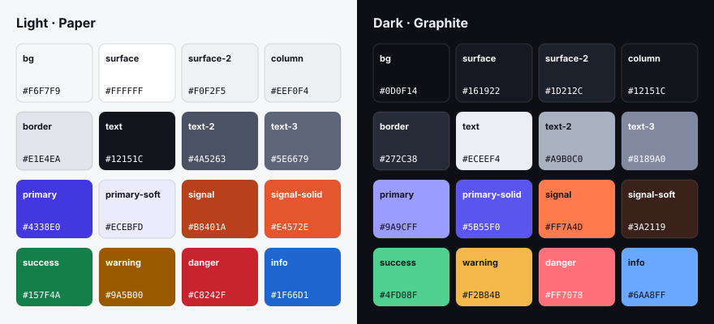
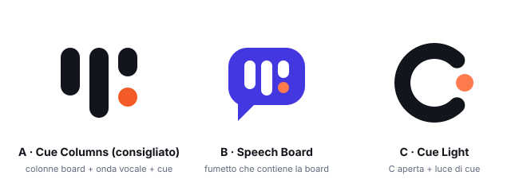

# BoardCue AI — valutazione di commerciabilità (UI, flussi, logiche, brand)

> 23 settembre 2026 · repository `PlanPilot`, branch `main`, commit `ad52350` · lettura completa di pagine, componenti, API, schema dati e CSS, più un controllo del sito pubblico `boardcue.draftapps.it` (demo e prezzi, desktop 1440 px e mobile 375 px).
> **Limiti:** i flussi autenticati (board, impostazioni, billing) sono stati valutati **leggendo il codice**, non provati con un account reale. Nessuna chiamata AI, email o pagamento reale. I prezzi dei concorrenti sono indicativi e vanno verificati prima di usarli in un listino.
> **Aggiornamento:** i correttivi realizzabili nel codice sono stati sviluppati sul branch `feat/commercial-readiness`; per ogni punto lo stato (eseguito, in parte, azione del titolare) è nella [§10](#10-mappa-di-implementazione-23-settembre-2026).
> Si affianca a [AUDIT_2026-09-19](AUDIT_2026-09-19.md) (sicurezza delle scritture) senza ripeterlo: qui la prospettiva è **"lo posso vendere domani?"**.

---

## 0. Sintesi

**Verdetto: il prodotto è una base tecnica seria (scritture transazionali, audit, undo, ZDR, quote, lifecycle, PWA), ma non è ancora commerciabile.** Mancano tre cose: (1) un'esperienza AI che l'utente possa controllare e di cui possa fidarsi, (2) una collaborazione di team che regga l'uso reale, (3) un'identità visiva coerente e "da strumento di lavoro". Si aggiungono prerequisiti legali e fiscali italiani ancora aperti.

### I 12 blocchi principali (P0 = da risolvere prima di vendere)

| # | Area | Problema | Perché blocca la vendita |
|---|---|---|---|
| 1 | Acquisizione | In produzione la root `/` porta a **/login**: il deploy è indietro rispetto al repo, dove `/` è la landing | Chi arriva da un link o da una ricerca vede un form di login, non il prodotto |
| 2 | Demo | La demo **crea sempre una card nuova** con una regex e **non sposta mai quella esistente** ("Ho finito la migrazione newsletter" crea un duplicato in Done) | Contraddice la promessa principale: "l'AI aggiorna la board esistente" |
| 3 | Loop AI | L'AI **applica subito** le modifiche, senza anteprima né conferma; l'undo è l'unica rete | Un'AI che modifica dati condivisi senza chiedere non passa una valutazione B2B |
| 4 | Collaborazione | **Revisione globale per board**: ogni modifica di chiunque invalida quelle degli altri → errore 409 "Board changed. Reload and retry." (in inglese). Aggiornamento solo con polling ogni 15 s | Con 3 o più persone attive gli errori diventano la norma |
| 5 | Card | La card non mostra **scadenza**, stato di ritardo né checklist; niente commenti, allegati, menzioni o vista dettaglio | Sotto la soglia minima di qualunque tool kanban del 2026 |
| 6 | Prezzi | Quota AI espressa come "**+250% rispetto a Solo**"; Team a **€24 per 10 persone** (€2,40 a testa) | Il cliente non capisce cosa compra, e il piano Team lascia molto margine sul tavolo |
| 7 | Trial | 7 giorni, **1 membro, 1 workspace**: il valore di team non si può provare | Non si converte un team che non ha mai visto il prodotto usato in gruppo |
| 8 | Fiscale IT | Nessuna raccolta di P.IVA, codice fiscale o codice SDI/PEC; nessuna **fattura elettronica** | In Italia, senza questi dati, il B2B non si può fatturare |
| 9 | Legale | Termini "bozza operativa", privacy "da rivedere", subprocessori incompleti, titolare persona fisica, nessun DPA art. 28 scaricabile | Blocco per qualunque cliente aziendale |
| 10 | Brand/UI | **Tre sistemi visivi sovrapposti**, tre loghi diversi, font dichiarato ma mai caricato, bottone primario con contrasto **3,69:1** (sotto AA) | Aspetto da prototipo; incoerenza percepita come scarsa affidabilità |
| 11 | Onboarding | Verifica email obbligatoria **prima** del primo accesso e account non verificati **cancellati dopo 24 h** | Chi si registra la sera e verifica il giorno dopo può trovare l'account cancellato |
| 12 | Operatività | Nessun monitoraggio errori, status page o backup verificato; rate limit in memoria; nessun ambiente di staging | Non si può promettere disponibilità a chi paga |

---

## 1. Posizionamento

**Punto di forza reale:** "aggiorni la board parlando" è un differenziatore chiaro, dimostrabile in dieci secondi e difendibile grazie alla patch strutturata, alla validazione e all'undo. Pochi concorrenti lo fanno *sulla board esistente* anziché generare testo.

**Rischi:**
- Trello, Asana, ClickUp, Notion e Linear hanno tutti un livello AI. Il confronto "Trello con l'AI" è perdente: vince la *nicchia*, non la categoria.
- Il sito comunica tecnologia (ZDR, patch, provider) più che risultati per una persona precisa.

**Raccomandazione di nicchia** (da validare con 10–15 interviste):
1. **Studi e agenzie italiane da 3 a 25 persone** (consulenza, marketing, web): tanti progetti-cliente, aggiornamenti frequenti, poca voglia di "mantenere il Trello". Il preset CONSULTING esiste già.
2. **Team operativi e sul campo** (manutenzione, installatori, eventi): aggiornano da smartphone, a voce, tra un intervento e l'altro. La PWA c'è già, manca la "cattura rapida vocale".

Claim suggerito: *"Racconta com'è andata. La board si aggiorna da sola."* Va sempre accompagnato da un video di 20 secondi del loop reale.

---

## 2. Flussi: analisi per tappa del percorso cliente

Legenda: **P0** blocca la vendita · **P1** necessario per un MVP commerciale · **P2** crescita o rifinitura.

### 2.1 Acquisizione (landing, demo, prezzi)

| Pri | Rilievo | Evidenza | Correttivo |
|---|---|---|---|
| P0 | La root di produzione porta a `/login` | Verifica live del 23/09: `/` → `/login`; nel repo `app/page.tsx` è la landing | Deploy dell'HEAD; test e2e di smoke su `/` in CI post-deploy |
| P0 | La demo non dimostra il prodotto: regex sulle parole, card sempre nuova, nessun aggiornamento di card esistenti | `components/DemoBoard.tsx` (`targetColumn`, `titleFromUpdate`) | Demo **scriptata e deterministica**: per 5–6 frasi d'esempio, patch precalcolate che *spostano e modificano* card esistenti con evidenziazione prima/dopo. In alternativa una demo AI reale con limiti stretti per IP |
| P1 | Demo su mobile: board larga 1625 px con `min-width:1160px` e scroll orizzontale, senza il navigatore colonne che la board reale ha | Misura live 375 px | Riusare `mobile-column-nav` di `Board.tsx` |
| P1 | Nessuna prova sociale, nessuno screenshot del prodotto reale, nessun video, nessuna FAQ | `app/page.tsx` | Video del loop, 3 casi d'uso per persona, FAQ (privacy, prezzi, lingue), loghi o testimonianze dei beta tester |
| P1 | Lingua: `<html lang="it">` fisso, titolo e meta in inglese, contenuti in italiano, preset in 7 lingue | `app/layout.tsx` | Decidere il mercato: IT come prima lingua, EN come seconda con percorsi `/en`. Titoli e meta coerenti |
| P2 | Il pulsante Home nella demo punta all'URL assoluto di produzione | `app/demo/page.tsx:42` | Link relativo `/` |
| P2 | Il checkout da non loggato manda a `/register` perdendo il piano scelto | `PricingActions.tsx` | `/register?plan=TEAM` → dopo la verifica, checkout diretto |

### 2.2 Registrazione, verifica, accesso

| Pri | Rilievo | Correttivo |
|---|---|---|
| P0 | Account non verificati eliminati dopo 24 h dal job di retention | Portare a 7 giorni, con promemoria a 1 e 5 giorni |
| P1 | Accesso bloccato fino alla verifica email: attrito proprio nel momento di massima motivazione | Accesso immediato con banner "verifica entro 7 giorni"; inviti e checkout sbloccati solo dopo la verifica |
| P1 | Il form chiede il nome dell'organizzazione (E04 dell'audit) | Rimuoverlo: si usa "Team di {nome}", modificabile in seguito |
| P1 | Nessun login social o passwordless (magic link, Google, Microsoft) | Magic link subito; Google e Microsoft per il B2B |
| P1 | Nessuna 2FA | TOTP per gli owner, obbligatoria nel piano Enterprise |
| P2 | Ramo di codice morto: dopo la registrazione si va sempre a `/login?registered=1`, quindi lo stato "Controlla la tua email" con "Invia di nuovo" non compare mai | `AccountForm.tsx:57` contro `AccountForm.tsx:87` |
| P2 | Copy: "Bentornato." è declinato al maschile; "← Torna alla demo" in fondo al login è fuori contesto | "Bentornato/a" o "Accedi a BoardCue"; link a Home |
| P2 | La pagina di registrazione non ha topbar né footer (link legali), il login sì | Uniformare il layout delle pagine di autenticazione |

### 2.3 Onboarding e prima board

| Pri | Rilievo | Correttivo |
|---|---|---|
| P0 | Dopo il primo accesso l'utente trova una dashboard amministrativa (piano, licenza, organizzazioni) invece di una board | Primo accesso = **board già creata** con 4–5 card d'esempio e un coach-mark sul composer: "Prova a dire: ho finito X". L'"aha" deve arrivare in meno di 60 secondi |
| P1 | Due pagine quasi uguali: Home `/app` e "Board" `/workspaces` | Una sola home: board recenti in alto, creazione, e a lato lo stato del piano |
| P1 | Checklist di attivazione assente | Checklist: prima frase AI → prima dettatura → primo invito → prima card spostata |
| P1 | Il testo "Potrai cambiare entrambi in seguito" (modello e lingua) è falso per la lingua: `locale` e `dictationEnabled` si cambiano solo dall'API superadmin (`app/api/admin/workspaces/[slug]/settings`). La landing dice anche che la dettatura "può essere attivata o disattivata per ogni workspace" | Portare lingua e dettatura nelle impostazioni della board per OWNER e ADMIN |
| P2 | Import assente | Import da CSV e da JSON di Trello (principale leva di switching) |

### 2.4 Loop principale: aggiornamento AI e voce

È il cuore del prodotto e oggi il suo punto più fragile.

| Pri | Rilievo | Evidenza | Correttivo |
|---|---|---|---|
| P0 | Applicazione immediata senza anteprima | `ingest/route.ts`, già segnalato nell'audit del 19/09 come gate di rilascio | **Anteprima con diff**: le card toccate vengono evidenziate sulla board con chip "↦ Done", "+ nuova", "✎ scadenza 30/9"; pulsanti *Applica tutto*, *Modifica*, *Scarta* e selezione per singola azione. Opzione "applica automaticamente" per utente, disattivata di default |
| P0 | Nessuna misura della qualità del modello | Audit: "la comprensione del modello non è stata valutata" | Set di valutazione: 200 frasi italiane sintetiche con patch attesa (negazioni, ipotesi, omonimie, date relative, più card nella stessa frase). Metriche: precisione delle azioni, falsi positivi, duplicati. Da eseguire a ogni cambio di modello o prompt |
| P1 | Nessuna domanda di chiarimento: se la frase è ambigua il modello indovina o non fa nulla | `openrouter.ts` | Aggiungere all'output un campo `clarification` ("Intendi 'Newsletter Q3' o 'Newsletter clienti'?") con risposte rapide |
| P1 | Il contesto inviato è **l'intera board** a ogni richiesta: costo e latenza crescono con le card, la qualità cala | `openrouter.ts` (`CURRENT PLAN JSON`) | Potatura: niente archiviate, descrizioni troncate, pre-selezione delle card candidate per somiglianza col testo |
| P1 | Voce: nessun timer, nessun livello audio, nessun annulla, nessuna durata massima; il `fetch` della trascrizione non ha try/catch, quindi un errore di rete lascia la UI "busy" | `Board.tsx:20` (`toggleRecord`) | Tieni premuto per parlare (mobile) o tocca per avviare/fermare; waveform live, timer, "Annulla", limite di 2 minuti, errori gestiti. Opzione "invia subito dopo la trascrizione" |
| P1 | Errori del provider mostrati all'utente così come arrivano e in inglese (`raw?.error?.message`, "AI quota reached…", "Audio too large…") | `transcribe/route.ts:30` e altri | Catalogo di errori con codice, messaggi in italiano, nessun dettaglio del provider (coerente con la promessa "provider non esposti") |
| P1 | Modello di dettatura fisso nel codice (`whisper-large-v3-turbo`) anche se il workspace ha il campo `transcriptionModel`; il modello di pianificazione di default è `gpt-5-nano` anche se il catalogo raccomanda `gpt-oss-120b` | `transcribe/route.ts`, `lib/workspace.ts:108` | Decidere il modello tramite il set di valutazione, poi usare davvero i campi del workspace |
| P1 | Attività AI: mostra solo il testo e il riassunto, non **chi**, **quando** e **cosa è cambiato**; solo gli ultimi 12 log; "Annulla" senza spiegare cosa verrà ripristinato | `board/route.ts:12`, `Board.tsx:31` | Pannello laterale "Attività" con autore, ora, elenco azioni cliccabili (evidenziano la card), filtro AI/manuale e undo con anteprima |
| P2 | Scorciatoia globale assente | — | Tasto `/` o `Ctrl+K` per aprire il composer da qualunque punto; `M` per il microfono |

### 2.5 Collaborazione di team

| Pri | Rilievo | Evidenza | Correttivo |
|---|---|---|---|
| P0 | Lock di concorrenza a livello **board**: qualsiasi modifica incrementa `workspace.revision` e le altre scritture in volo falliscono | `lib/board.ts` (`assertRevision`), errore 409 in `cards/[cardId]/route.ts:34` | Concorrenza ottimistica **per card** (`version` o `updatedAt` per entità) e merge per campo; mantenere il lock di board solo per le patch AI multi-card |
| P0 | Nessun tempo reale: polling ogni 15 s | `Board.tsx` (`setInterval(load, 15000)`) | SSE con Postgres `LISTEN/NOTIFY` (nessun servizio esterno), aggiornamento incrementale |
| P1 | Inviti: solo creazione. Nessun elenco degli inviti pendenti, nessun reinvio o revoca da UI | `invites/route.ts` ha solo `POST` | Elenco pendenti con scadenza, reinvio, revoca, link copiabile |
| P1 | Nessun commento, menzione o notifica mirata (le push sono generiche e portano a `/app`) | `lib/push.ts`, doc PWA | Commenti con `@menzione`, notifiche per assegnazione/menzione/scadenza, digest email giornaliero opzionale |
| P1 | Ordinamento dentro la colonna non gestito: lo spostamento cambia solo `columnId`, la `position` resta quella vecchia | `cards/[cardId]/route.ts` | Drag verticale con posizione frazionaria (lexorank) |
| P2 | Nessun ruolo "sola lettura / ospite cliente" | Schema: OWNER/ADMIN/MEMBER | Ruolo GUEST per i clienti delle agenzie, utile anche per vendere il piano Studio |

### 2.6 Piani, billing, quote

Vedi anche §4 (economia).

| Pri | Rilievo | Correttivo |
|---|---|---|
| P0 | Nessuna raccolta di dati fiscali (ragione sociale, P.IVA, CF, SDI/PEC) e nessuna fattura elettronica | Stripe Tax più un connettore SDI (es. un gestionale di fatturazione italiano) oppure fatturazione tramite provider "merchant of record". Campi obbligatori al checkout B2B |
| P0 | Quota in "% rispetto a Solo" e barra "AI 34%" | Unità comprensibile: **aggiornamenti AI al mese** (1 dettatura + 1 applicazione = 1 aggiornamento). Contatore "142 / 1.000 · si rinnova il 1/10" |
| P1 | Trial senza team | Trial di 14 giorni con le funzioni Team (fino a 5 membri) |
| P1 | Piano annuale assente | Annuale con 2 mesi gratis |
| P1 | Pagina prezzi: seleziona la prima org in cui l'utente è OWNER, non quella predefinita | `app/pricing/page.tsx` → selettore esplicito se le org sono più d'una |
| P1 | Email del ciclo di vita del trial assenti o non verificabili | Sequenza: benvenuto, giorno 3 (consiglio d'uso), giorno 6 (scadenza), fine trial, +7, +25 (prima dell'eliminazione) |
| P2 | Dunning (pagamento fallito), coupon, referral | Stripe Smart Retries + email; coupon per i beta tester |

### 2.7 Account e organizzazioni

| Pri | Rilievo | Correttivo |
|---|---|---|
| P1 | Il modello dati è esposto nella UI: "Organizzazione predefinita", "Personale / Business", "Licenza MANUAL/STRIPE", `legalType`, ruoli `OWNER`, stato Stripe grezzo (`active`, `past_due`) | Tradurre tutto; nascondere licenza e tipo legale (utili solo al backoffice) |
| P1 | Terminologia: "workspace" e "board" usati per la stessa cosa; la voce di menu "Board" apre `/workspaces` | Glossario unico: **Team** (= Organization, fatturazione) → **Board** (= Workspace). Rinominare nella UI, non nel DB |
| P1 | Nessun selettore di team nella topbar, nessun menu utente con avatar | Topbar: logo · selettore Team · ricerca · campanella · avatar (Account, Fatturazione, Esci) |
| P2 | Eliminazione account personale self-service non evidente (diritto GDPR alla cancellazione) | Voce "Elimina account" con export preventivo |

### 2.8 Uscita, export, conservazione dei dati

- Export della board in JSON: solo card attive, senza assegnatari né storico (audit). **P1**: aggiungere export CSV (apribile in Excel) e un export completo documentato; il pulsante "Export" nella board scarica un JSON che un utente normale non sa usare.
- Retention e cancellazione (30 giorni in sola lettura, poi eliminazione): corretta come politica, ma va **comunicata** via email e nella UI con un conto alla rovescia.

---

## 3. Logiche e architettura (ciò che serve per reggere clienti paganti)

| Pri | Tema | Stato | Correttivo |
|---|---|---|---|
| P0 | Osservabilità | Nessun error tracking, nessuna metrica, log solo del container | Error tracking self-hosted o UE, uptime check, status page pubblica |
| P0 | Backup | Non verificati (audit) | Backup giornalieri cifrati fuori dal server e **prova di ripristino** documentata ogni mese |
| P0 | Deploy | La produzione non corrisponde all'HEAD | Ambiente di staging, deploy da tag, smoke test post-deploy |
| P1 | Rate limit | `Map` in memoria (`lib/security.ts`): si azzera a ogni riavvio e non vale con più istanze | Tabella Postgres o Redis; limiti anche su login e registrazione per IP ed email |
| P1 | Quote | Controllo e registrazione dei consumi separati: sforabili con richieste concorrenti (audit) | Riserva atomica del consumo prima della chiamata, conguaglio dopo |
| P1 | Messaggi di errore | API miste italiano/inglese e mostrate direttamente nella UI (~40 stringhe diverse) | Codici di errore stabili (`BOARD_CONFLICT`, `QUOTA_EXHAUSTED`…) tradotti nel client |
| P1 | i18n | Nessuna infrastruttura: tutte le stringhe sono nel JSX | `next-intl` o equivalente; IT/EN al lancio |
| P1 | Manutenibilità | Componenti minificati su una riga (`Board.tsx`: 13 KB in 34 righe, `AdminPanel.tsx`: 25 KB), CSS in 4 file sovrapposti | Formattazione (Prettier), divisione di `Board` in Composer, Column, Card, CardDialog, ActivityPanel; design token unici (§5) |
| P1 | Protezione delle route | Controlli dentro i singoli handler, nessun middleware (audit) | Middleware per le route `/app/*` e test negativi sistematici |
| P2 | Analytics di prodotto | Nessuno (scelta privacy dichiarata) | Eventi di prodotto anonimi e aggregati, self-hosted, senza cookie: servono per misurare attivazione e conversione (§8) |
| P2 | API pubblica e webhook | Assenti | API con token personale; webhook su card cambiata (Zapier/n8n: il target naturale del pubblico) |

---

## 4. Prezzi ed economia unitaria

**Costo stimato di un aggiornamento AI** (stima da verificare con i dati reali di `UsageEvent`): board media di circa 5k token in ingresso e 600 in uscita con `gpt-5-nano` ≈ **$0,0005**; 30 secondi di dettatura con Whisper turbo ≈ **$0,0003**. Totale **≈ $0,001 per aggiornamento vocale**.

| Piano | Prezzo | Budget AI | ≈ aggiornamenti/mese | Costo AI massimo sul prezzo |
|---|---|---|---|---|
| Trial | €0 | $0,05 | ~50 | — |
| Solo | €10 | $4 | ~4.000 | ~37% |
| Team | €24 (10 persone) | $14 | ~14.000 | ~54% |
| Studio | €59 (24 persone) | $40 | ~40.000 | ~63% |

Osservazioni:
1. I budget sono **molto generosi** rispetto all'uso realistico (un utente attivo fa 5–20 aggiornamenti al giorno, cioè 100–400 al mese). Nel caso peggiore, però, il margine di Team e Studio si assottiglia. Conviene esprimere e limitare in **aggiornamenti**, non in dollari; il cambio USD/EUR resta un rischio interno.
2. **Team è sottoprezzato**: €2,40 a persona, mentre i riferimenti di mercato (indicativi, da verificare) stanno tra $5 e $11 a utente al mese per i piani base dei principali tool kanban, con l'AI spesso come componente aggiuntivo a pagamento.
3. Solo con 6 workspace e Team con 10 non scalano in modo logico.

**Listino adottato** (IVA esclusa), dopo la revisione del titolare del 23 settembre. La proposta iniziale (piano Free, minimo 3 posti, SSO) è stata **sostituita**: niente Free, dettatura sempre inclusa, board illimitate, Team e Business da 2 posti, niente SSO/DPA/SLA, costi di infrastruttura del titolare inclusi nel calcolo. Dettagli e margini in [PRICING_ECONOMICS.md](PRICING_ECONOMICS.md).

| Piano | Prezzo | Include |
|---|---|---|
| **Prova Pro** | €0 per 14 giorni, senza carta | funzioni Pro, 1 persona, 150 aggiornamenti AI |
| **Pro** | €7/mese (€69,60/anno); privati €8,50 IVA inclusa | 1 persona, board illimitate, 800 aggiornamenti/mese, dettatura, anteprima, viste, import/export, 2FA |
| **Team** | €6 per posto/mese, minimo 2 (€60/anno); privati €7,30 | 600 aggiornamenti per posto condivisi, tempo reale, commenti, ospiti gratuiti, API e webhook |
| **Business** | €10 per posto/mese, minimo 2 (€99,60/anno); privati €12,20 | 1.000 aggiornamenti per posto, 2FA obbligatoria per il team, export audit, supporto prioritario |
| **Enterprise** | su preventivo, da 25 posti | prezzo per volume, quote su misura, fatturazione annuale, onboarding |

Pacchetto: +1.000 aggiornamenti a €6, non scadono. Chi non paga viene **congelato** (sola lettura ed export), mai cancellato. Ogni prezzo mensile mostrato (privati IVA inclusa e mensile equivalente degli annuali) è arrotondato per difetto alla decina di centesimi. Stripe: prezzi creati in automatico sull'account esistente. Pareggio dei costi fissi stimati (€60/mese): 10–14 clienti Pro, circa 12 (con Pro a €12 erano 7). Dettagli in [PRICING_ECONOMICS.md](PRICING_ECONOMICS.md).

---|---|---|
| **Free** (al posto del trial che scade) | €0 | 1 persona, 2 board, 30 aggiornamenti AI al mese, niente dettatura. Porta d'ingresso permanente |
| **Pro** | €9/mese | 1 persona, board illimitate, 600 aggiornamenti al mese, dettatura |
| **Team** | €7 a persona al mese (minimo 3) | Aggiornamenti in pool da 400 a persona, ruoli, ospiti, commenti, notifiche |
| **Business** | €12 a persona al mese | + SSO Google/Microsoft, audit esportabile, retention configurabile, supporto prioritario |
| **Enterprise** | su misura | SSO SAML, DPA dedicato, SLA, routing AI concordato |

Pacchetti aggiuntivi: +1.000 aggiornamenti a €5. Annuale: −17%. Trial: 14 giorni di Team senza carta, poi passaggio automatico a Free (i dati restano: niente cancellazione dopo 30 giorni per chi non paga, basta la sola lettura oltre i limiti Free).

---

## 5. UI: valutazione

### 5.1 Stato attuale del sistema visivo

Oggi convivono **quattro livelli CSS** che si sovrascrivono a vicenda:

| File | Linguaggio | Token |
|---|---|---|
| `app/globals.css` | Originale: indigo `#5a63e8`, raggi 10–18 px, ombre morbide | `--bg`, `--accent`, … (43 hex unici) |
| `app/draftapps-theme.css` (1ª metà) | "Glass": gradiente ciano `#6ae0ff` → viola `#9b7cff`, pill arrotondate | `--da-*` |
| `app/draftapps-theme.css` (da riga 90) | **Draft UI Language v1.1**: neo-brutalista, raggi 0, ombre offset 3–4 px, `#101010`, primario `#6977ff`, ciano, giallo, rosa | `--draft-*` (rimappa `--da-*`) |
| `app/pwa.css` | Slate proprio `#101827` / `#172033`, raggi 20 px | nessuno |

A questo si aggiungono `theme-color` e manifest `#101827` (diversi dallo sfondo reale `#101010`), email con primario `#6256e8` e l'icona dell'app con gradiente ciano-blu-magenta e bagliore.

### 5.2 Problemi di UI (ordinati per impatto)

1. **Identità "portfolio", non "strumento"**: angoli a zero, ombre offset e `translate(-2px,-2px)` al passaggio del mouse su *ogni* card e bottone creano rumore su una board densa e fanno "saltare" le card durante il drag. È il linguaggio dello studio Draftapps, non di un prodotto SaaS in cui si passano ore.
2. **Contrasto**: testo bianco su `#6977ff` (bottone primario in tema scuro) = **3,69:1**, sotto il minimo AA di 4,5:1 per il testo a 14 px. Valori codificati come `#63e6a6` (1,5:1 sul chiaro) sopravvivono solo perché un livello successivo li sovrascrive: basta cambiare l'ordine degli import per romperli.
3. **Font**: `Inter` è dichiarato ma **mai caricato** (nessun `next/font` o `@font-face`): su Windows si vede Segoe UI, su Mac SF. Resa diversa per ogni cliente.
4. **Icone**: emoji e caratteri Unicode (`🌙 ☀️ 🎙 ✦ ▦ ◎ ⚙ ● ■ ↗ ◉`) usati come icone e come logo nella topbar (`Brand.tsx` usa `◉`). Resa diversa per sistema operativo e poco professionale.
5. **Card povere**: niente scadenza, ritardo o conteggio checklist. Priorità mostrata con l'enum inglese (`URGENT`, `HIGH`) mentre i filtri sono in italiano. Ogni card mostra sempre la select "Sposta in…" e "Archivia": ingombro visivo su ogni card.
6. **Testi tecnici esposti**: "OWNER · revisione 12" nella toolbar, "Licenza MANUAL", "Provisioning non disponibile", "Il provisioning automatico non è riuscito", "Stato: active".
7. **Dialoghi nativi**: `window.prompt` per rinominare (`WorkspaceList.tsx:43`), `confirm()` per archiviare ed eliminare.
8. **Modale card non accessibile**: niente `role="dialog"`/`aria-modal`, niente Esc, niente focus trap; un clic sullo sfondo chiude e **perde le modifiche** senza avviso.
9. **Stati vuoti e caricamento**: solo "Caricamento board…" in testo; nessuno skeleton, nessuno stato vuoto per colonna ("Trascina qui o racconta cosa è cambiato").
10. **Topbar autenticata**: sei elementi piatti (tema, App, Home, Board, Account, Esci) che su mobile vanno a capo; niente selettore di team, ricerca, notifiche o avatar.
11. **Tema**: toggle a 2 stati senza "Sistema"; in caso di errore di `localStorage` forza il tema scuro.
12. **Tema chiaro "carta calda"** `#f2efe7` abbinato a un indigo freddo e a un ciano petrolio: temperatura incoerente.

### 5.3 Principi per il nuovo sistema

- **Calmo per default, vivo quando parla l'AI.** Neutri grafite, un solo primario; il colore *signal* (arancio "cue") è riservato a voce, AI e registrazione. Se tutto è colorato, nulla segnala.
- **Raggi moderati** (6 px controlli, 10 px card, 14 px pannelli), ombre morbide a 2 livelli, nessun movimento al passaggio del mouse sulle card (solo bordo ed elevazione).
- **Un solo file di token** (`app/tokens.css`), tre livelli: primitivi → semantici → componenti. Nessun hex nei componenti.
- **Densità**: 14 px per il testo base della board, 13 px per i metadati, 12 px minimo assoluto.
- **Font caricati e self-hosted** con `next/font` (niente richieste a Google a runtime, meglio anche per il GDPR): **Geist Sans** e **Geist Mono** (licenza OFL), oppure **Inter** come alternativa conservativa.
- **Icone**: Lucide (licenza ISC), tratto 1,75 px.

---

## 6. Nuova palette dark / light



Due temi con la stessa struttura semantica. **Tutti i rapporti di contrasto sono stati calcolati** (formula WCAG 2.x): i valori sono riportati sotto.

### 6.1 Light — "Paper"

| Token | Hex | Uso | Contrasto |
|---|---|---|---|
| `--bg` | `#F6F7F9` | Sfondo app | — |
| `--surface` | `#FFFFFF` | Card, pannelli, modali | — |
| `--surface-2` | `#F0F2F5` | Input, hover, righe alterne | — |
| `--column` | `#EEF0F4` | Sfondo colonne kanban | — |
| `--border` | `#E1E4EA` | Bordi decorativi | — |
| `--border-strong` | `#8C93A3` | Bordi di input e controlli | 3,08:1 su surface ✔ (UI ≥ 3) |
| `--text` | `#12151C` | Testo primario | 18,3:1 su surface · 16,0:1 su column |
| `--text-2` | `#4A5263` | Testo secondario | 7,8:1 |
| `--text-3` | `#5E6679` | Metadati, placeholder | 5,75:1 su surface · 5,04:1 su column |
| `--primary` | `#4338E0` | Bottoni primari, link, focus | 7,3:1 su bianco (bianco su primary: 7,3:1) |
| `--primary-hover` | `#3A2FCC` | Hover e pressed | — |
| `--primary-soft` | `#ECEBFD` | Selezione, badge, card evidenziata | primary su soft: 6,2:1 |
| `--signal` | `#B8401A` | Testo e icone AI/voce | 5,55:1 su bianco · 4,89:1 su signal-soft |
| `--signal-solid` | `#E4572E` | Pulsante microfono, pallino di registrazione | Icona bianca 3,68:1 · icona ink 4,96:1 |
| `--signal-soft` | `#FFEDE5` | Evidenziazione delle modifiche proposte dall'AI | — |
| `--success` | `#157F4A` | Completato, salvato | 5,0:1 |
| `--warning` | `#9A5B00` | In scadenza, quota all'80% | 5,4:1 |
| `--danger` | `#C8242F` | Errori, ritardo, azioni distruttive | 5,6:1 |
| `--info` | `#1F66D1` | Informazioni neutre | 5,4:1 |

### 6.2 Dark — "Graphite"

| Token | Hex | Uso | Contrasto |
|---|---|---|---|
| `--bg` | `#0D0F14` | Sfondo app | — |
| `--surface` | `#161922` | Card, pannelli | — |
| `--surface-2` | `#1D212C` | Input, hover, modali | — |
| `--column` | `#12151C` | Sfondo colonne | — |
| `--border` | `#272C38` | Bordi decorativi | — |
| `--border-strong` | `#6B7389` | Bordi di input e controlli | 3,71:1 ✔ |
| `--text` | `#ECEEF4` | Testo primario | 15,1:1 su surface |
| `--text-2` | `#A9B0C0` | Secondario | 8,1:1 |
| `--text-3` | `#8189A0` | Metadati | 5,0:1 su surface · 5,2:1 su column |
| `--primary` | `#9A9CFF` | Link, focus, testo accentato | 7,2:1 |
| `--primary-solid` | `#5B55F0` | Sfondo dei bottoni primari | Bianco su di esso: 5,25:1 ✔ (oggi 3,69) |
| `--primary-soft` | `#23234A` | Selezione, badge | `#B9BAFF` su di esso: 8,2:1 |
| `--signal` | `#FF7A4D` | AI/voce, pallino del logo | 6,8:1 su surface; ink su signal: 7,1:1 |
| `--signal-soft` | `#3A2119` | Evidenziazione delle proposte AI | signal su di esso: 5,8:1 |
| `--success` | `#4FD08F` | | 9,0:1 |
| `--warning` | `#F2B84B` | | 9,8:1 |
| `--danger` | `#FF7078` | | 6,6:1 |
| `--info` | `#6AA8FF` | | 7,2:1 |

### 6.3 Colori di priorità (entrambi i temi, sempre con etichetta testuale e icona)

| Priorità | Light (testo / sfondo) | Dark (testo / sfondo) | Icona |
|---|---|---|---|
| Urgente | `#C8242F` / `#FDECEC` | `#FF7078` / `#3A1A1E` | `alert-octagon` |
| Alta | `#9A5B00` / `#FFF4E0` | `#F2B84B` / `#35280F` | `chevrons-up` |
| Normale | nessun badge | nessun badge | — |
| Bassa | `#4A5263` / `#F0F2F5` | `#A9B0C0` / `#1D212C` | `chevron-down` |

### 6.4 Regole d'uso

- **Il signal non si usa mai per errori o successi**: vale solo per "l'AI o la voce stanno agendo". Una card modificata dall'AI mostra per 8 secondi un bordo sinistro `--signal` e un fondo `--signal-soft`, poi torna neutra.
- Il **primario** è per l'azione principale di ogni schermata (uno solo per vista) e per il focus.
- Il **focus** si mostra sempre: `outline: 2px solid var(--primary); outline-offset: 2px`.
- Gli stati semantici hanno sempre **icona + testo**, mai solo colore.
- Aggiornare di conseguenza `theme-color` (`#F6F7F9` / `#0D0F14` con `media`), manifest e template email.

### 6.5 Token pronti

```css
/* app/tokens.css — unica fonte dei colori. Sostituisce --accent / --da-* / --draft-* */
:root, [data-theme="light"] {
  color-scheme: light;
  --bg:#F6F7F9; --surface:#FFFFFF; --surface-2:#F0F2F5; --column:#EEF0F4;
  --border:#E1E4EA; --border-strong:#8C93A3;
  --text:#12151C; --text-2:#4A5263; --text-3:#5E6679;
  --primary:#4338E0; --primary-hover:#3A2FCC; --primary-solid:#4338E0; --on-primary:#FFFFFF; --primary-soft:#ECEBFD;
  --signal:#B8401A; --signal-solid:#E4572E; --signal-soft:#FFEDE5;
  --success:#157F4A; --warning:#9A5B00; --danger:#C8242F; --info:#1F66D1;
  --shadow-1:0 1px 2px rgba(18,21,28,.06),0 1px 1px rgba(18,21,28,.04);
  --shadow-2:0 8px 24px rgba(18,21,28,.10),0 2px 6px rgba(18,21,28,.06);
  --radius-control:6px; --radius-card:10px; --radius-panel:14px;
}
[data-theme="dark"] {
  color-scheme: dark;
  --bg:#0D0F14; --surface:#161922; --surface-2:#1D212C; --column:#12151C;
  --border:#272C38; --border-strong:#6B7389;
  --text:#ECEEF4; --text-2:#A9B0C0; --text-3:#8189A0;
  --primary:#9A9CFF; --primary-hover:#B1B2FF; --primary-solid:#5B55F0; --on-primary:#FFFFFF; --primary-soft:#23234A;
  --signal:#FF7A4D; --signal-solid:#FF7A4D; --signal-soft:#3A2119;
  --success:#4FD08F; --warning:#F2B84B; --danger:#FF7078; --info:#6AA8FF;
  --shadow-1:0 1px 2px rgba(0,0,0,.4);
  --shadow-2:0 12px 32px rgba(0,0,0,.45),0 2px 6px rgba(0,0,0,.3);
}
```

Nota: lo script in `app/layout.tsx` imposta sempre `data-theme` (preferenza salvata oppure `prefers-color-scheme`), quindi bastano i due selettori; conviene aggiungere al toggle la terza opzione "Sistema". In dark, i bottoni primari usano `--primary-solid` come sfondo e `--primary` per link e testo; in light coincidono.

**Migrazione** (circa 2–3 giorni): 1) creare `tokens.css`; 2) mappare temporaneamente `--da-*` e `--draft-*` sui nuovi token; 3) rimuovere `draftapps-theme.css` a blocchi, componente per componente; 4) eliminare tutti gli hex fuori da `tokens.css` (controllo in CI con `grep -E '#[0-9a-fA-F]{3,8}' app/*.css` escluso tokens); 5) test di regressione visiva con Playwright sulle pagine pubbliche nei due temi (la suite esiste già).

---

## 7. Nuovo logo

### 7.1 Diagnosi dell'esistente

Oggi ci sono **tre marchi** diversi:
- **Topbar**: carattere Unicode `◉` dentro un quadrato colorato (`components/Brand.tsx`);
- **Icona dell'app** (`app/icon.svg`): tre colonne e una waveform con gradiente ciano → blu → magenta e filtro glow. Il concetto è giusto (board + voce), ma l'esecuzione ha troppi elementi, sfuma sotto i 32 px, dipende dal gradiente e non funziona in monocromia;
- **Badge delle notifiche**: tre barre piatte.

Il nome "BoardCue **AI**" dentro il logo invecchierà presto: l'AI è una caratteristica, non il nome.

### 7.2 Idea: "cue"

*Cue* è il segnale che in teatro o in regia dice "adesso, tocca a te": è esattamente ciò che l'utente dà alla board quando parla. Il marchio deve unire in un segno solo tre significati:
1. **Board**: colonne kanban;
2. **Voce**: barre di altezza diversa, come una forma d'onda;
3. **Cue**: un punto luminoso, la "luce di cue" o il pallino di registrazione, che è anche *la card che si sposta*.



| Concept | Descrizione | Pro | Contro |
|---|---|---|---|
| **A · Cue Columns** ✅ | Tre colonne arrotondate **ancorate in alto** (quindi colonne kanban, non un grafico a barre) con altezze diverse, come una waveform. Sotto la colonna più corta c'è un punto arancio: la card appena mossa, la luce di cue | Unisce i tre significati; leggibile a 16 px; funziona in monocromia; ottimo come icona dell'app; il punto diventa un elemento di brand riusabile (indicatore di registrazione, badge AI, loader) | Va curato perché non ricordi un "equalizzatore" generico: le colonne ancorate in alto sono la chiave |
| B · Speech Board | Fumetto indigo con dentro la board | Comunica subito "parla" | Categoria affollata (chat e assistenti); i dettagli interni si perdono sotto i 24 px |
| C · Cue Light | "C" aperta con il punto nell'apertura | Minimale ed elegante | Non comunica né board né voce; debole senza il wordmark |

**Raccomandazione: concept A.**

### 7.3 Costruzione (concept A)

- Griglia 64 × 64, margine 8 px.
- Colonne larghe 12 px con raggio 6 px (terminali pieni), passo 18 px (spazio 6 px).
- Altezze **30 / 44 / 18** (rapporto ≈ 2 : 3 : 1,2), tutte con la cima a y = 10.
- Punto: diametro 12 px, **stessa larghezza della colonna**, 5 px sotto la terza colonna. Deve leggersi come "un pezzo della colonna che si è staccato".
- Colori: colonne in `--text` (ink `#12151C` sul chiaro, `#ECEEF4` sullo scuro); punto **Cue Orange** `#F25A28` sul chiaro (3,35:1 sul bianco) e `#FF7A4D` sullo scuro (7,4:1).
- **Icona dell'app**: fondo ink con gradiente leggero `#232838 → #0D0F14`, colonne `#F6F7F9`, punto `#FF7A4D`. Il fondo scuro distingue l'icona dalla massa di icone blu dei tool di produttività e dà al punto il massimo contrasto. Il marchio sta dentro la safe zone del formato maskable (cerchio all'80%).
- **Favicon a 16 px**: versione semplificata e ridisegnata, non scalata (colonne da 4 px, spazio 1 px, punto da 4 px).
- **Wordmark**: `boardcue` minuscolo, sans geometrica bold (Geist o Inter Tight 700, tracking −3%); "board" in ink e "cue" in primario. Nella versione finale va **disegnato e convertito in tracciati**, con correzioni ottiche su "a" e "e" e legatura "rd" più stretta. Il descrittore "AI planning board" va sotto o accanto, mai nel logo.

<p>


</p>

### 7.4 Bozze vettoriali incluse

In `docs/brand/`, generate come riferimento per il designer (non sono ancora gli asset definitivi):

| File | Contenuto |
|---|---|
| `boardcue-mark-light.svg` / `-dark.svg` | Marchio da solo |
| `boardcue-app-icon.svg` | Icona dell'app 512 px, compatibile maskable |
| `boardcue-favicon-16.svg` | Versione ottimizzata per 16 px |
| `boardcue-lockup-light.svg` / `-dark.svg` | Marchio + wordmark (wordmark ancora in testo vivo: provvisorio) |
| `boardcue-logo-concepts.svg` | Confronto dei concept A, B, C |
| `boardcue-palette.svg` | Palette light e dark |

### 7.5 Brief per il designer (per arrivare a un logo "di alta qualità")

1. Rifinitura ottica del concept A: le colonne a 44 px sembrano più pesanti, quindi serve una compensazione di ~0,5 px; il punto va allineato otticamente, non matematicamente.
2. Wordmark su misura, con 3 alternative di peso; test di leggibilità a 14 px nella topbar.
3. Sistema completo: marchio, lockup orizzontale e verticale, monocromo positivo e negativo, icona app (iOS, Android maskable, Windows), favicon 16/32/48, immagine social 1200×630, avatar per i social.
4. **Spazio di rispetto** pari al diametro del punto; dimensione minima 16 px (marchio) e 80 px (lockup).
5. **Da evitare**: gradienti sul marchio, glow, rotazioni, cambio del colore del punto, marchio sopra fotografie senza fondo.
6. Animazione (Lottie o CSS, meno di 1 s): il punto "cade" dalla terza colonna, le colonne oscillano come una waveform. Riutilizzabile come loader dell'elaborazione AI, al posto dell'attuale `process-loader`.
7. Verifiche legali: ricerca di anteriorità del marchio "BoardCue" (EUIPO, classi 9 e 42) e disponibilità del dominio `.com`/`.app` prima di investire nel brand. Oggi il prodotto vive su un sottodominio `draftapps.it`: per la vendita B2B serve un dominio proprio.

---

## 8. Metriche da misurare dal primo giorno

| Fase | KPI | Obiettivo iniziale |
|---|---|---|
| Attivazione | % di nuovi utenti con ≥ 1 aggiornamento AI applicato entro 10 minuti | > 60% |
| Qualità AI | % di patch applicate senza modifiche / % annullate | > 80% / < 5% |
| Voce | % di aggiornamenti arrivati da dettatura | indicatore della differenziazione |
| Collaborazione | % di trial con ≥ 2 membri attivi | > 30% |
| Conversione | trial → pagante | 8–15% |
| Retention | board con attività nelle settimane 4 e 8 | — |
| Affidabilità | errori 409 per 100 scritture; p95 della latenza AI | < 1; < 4 s |

---

## 9. Roadmap proposta

### Fase 0 — "Vendibile" (≈ 4–6 settimane)
1. Deploy dell'HEAD, staging, smoke test, backup con prova di ripristino, error tracking, status page.
2. Anteprima e conferma della patch AI, catalogo errori in italiano, voce robusta (timer, annulla, gestione errori).
3. Concorrenza per card + SSE (fine degli errori 409 di massa).
4. Card: scadenza visibile, ritardo, vista dettaglio con descrizione, checklist e commenti.
5. Demo scriptata che sposta davvero le card.
6. Listino in "aggiornamenti", trial di Team da 14 giorni, dati fiscali e fatturazione elettronica.
7. Termini, privacy, DPA e subprocessori rivisti da un legale; ragione sociale e P.IVA nel footer.
8. Onboarding con board precompilata; account non verificati conservati 7 giorni.

### Fase 1 — "MVP commerciale" (≈ 6–8 settimane)
1. Nuovi token e palette, font caricati, icone Lucide, nuovo logo; eliminazione del CSS stratificato.
2. Inviti pendenti, ruolo ospite, menzioni, notifiche mirate, digest email.
3. Import da Trello e CSV, export CSV.
4. i18n IT/EN, glossario Team/Board nella UI.
5. Set di valutazione AI in CI; potatura del contesto; domande di chiarimento.
6. Magic link, login Google/Microsoft, 2FA.

### Fase 2 — Crescita
Viste lista e calendario, cattura vocale rapida da PWA (scorciatoia sulla home del telefono), integrazioni (Slack/Teams, email → board, calendario), API e webhook, SSO SAML, audit esportabile, piano annuale, referral.

---

## 10. Mappa di implementazione (23 settembre 2026)

Tutti i punti del report, con lo stato dopo l'intervento. Legenda: **✅ Eseguito da Claude** · **🟡 Eseguito da Claude in parte** (il resto è indicato) · **🧑 Azione del titolare** (serve una decisione, un account esterno o un intervento fuori dal codice) · **↩️ Modificato o scartato su indicazione del titolare** · **⏭ Non implementato**.

Il lavoro è sul branch `feat/commercial-readiness`, **non committato e non distribuito**: nessun deploy, nessuna chiamata a Stripe, OpenRouter o SMTP reali.

### 10.1 Decisioni del titolare recepite

| Decisione | Come è stata applicata |
|---|---|
| Niente piano Free, solo prova del Pro | `lib/plans.ts`: `TRIAL` = "Prova Pro", 14 giorni, 1 persona, 150 aggiornamenti; nessun piano gratuito permanente |
| Board non limitate | `workspaceLimit: Infinity` in tutti i piani (test in `tests/plans.test.ts`) |
| Team e Business: minimo 2 posti | `minSeats: 2`, checkout Stripe per posto con quantità minima 2 e posti regolabili |
| Dettatura sempre disponibile | Inclusa in prova e in tutti i piani; resta solo l'interruttore per singola board scelto dall'owner |
| Niente SSO Google/Microsoft | Non implementato; al suo posto magic link e 2FA |
| Niente SSO, DPA e SLA nell'Enterprise | Rimossi da pagina prezzi, termini e testi; Enterprise = volume, quote, fatturazione annuale, onboarding |
| AI senza conservazione | `lib/ai-config.ts`: endpoint OpenRouter standard, `zdr: true`, `data_collection: "deny"`, fallback solo tra endpoint ZDR; modello predefinito Gemini 2.5 Flash-Lite, dettatura Voxtral Mini (decisione aggiornata: niente endpoint UE per non richiedere il piano Business; il fornitore non deve essere europeo) |
| Nessuna cancellazione per chi non paga, board congelate | Fine prova e abbonamento scaduto → sola lettura ed export; la migrazione 0011 azzera le date di eliminazione esistenti |
| Costi di infrastruttura nel pricing | [PRICING_ECONOMICS.md](PRICING_ECONOMICS.md): costi fissi stimati €60/mese, margini per piano, pareggio; `MONTHLY_FIXED_COST_EUR` nel backoffice |
| 2FA con app authenticator per tutti i piani | TOTP RFC 6238 + 10 codici di recupero, segreti cifrati AES-256-GCM; obbligatoria per il team nel Business |

### 10.2 I 12 blocchi principali (§0)

| # | Punto | Stato | Dove |
|---|---|---|---|
| 1 | Root di produzione che porta al login | 🧑 deploy dell'HEAD; ✅ workflow `smoke.yml` che lo verifica ogni 30 minuti | `docs/OPERATIONS.md` §1 |
| 2 | Demo che duplica le card | ✅ demo deterministica che riconosce la card, la sposta, gestisce negazioni e domande, stessa UI del prodotto | `lib/demo-planner.ts`, `components/DemoBoard.tsx` |
| 3 | AI applicata senza anteprima | ✅ proposta immutabile, anteprima con diff, applicazione parziale, ricevuta idempotente, scadenza 15 min, undo | `lib/ai-proposals.ts`, `app/api/workspaces/[slug]/proposals/*`, `components/board/ProposalPanel.tsx` |
| 4 | Conflitti 409 a livello board, polling 15 s | ✅ concorrenza per card (`version`), spostamenti che non collidono con le modifiche, SSE in tempo reale | `lib/board.ts`, `app/api/workspaces/[slug]/events` |
| 5 | Card povere | 🟡 scadenza e ritardo, checklist, commenti, menzioni, dettaglio e cronologia ✅; allegati ⏭ (serve uno storage file: decisione del titolare) | `components/board/CardDialog.tsx` |
| 6 | Quota in "% rispetto a Solo", Team sottoprezzato | ✅ quota in aggiornamenti AI; listino rivisto con il titolare | `lib/plans.ts`, `app/pricing` |
| 7 | Trial senza team | ↩️ su decisione del titolare la prova è del **Pro**, 14 giorni | `lib/plans.ts` |
| 8 | Dati fiscali e fattura elettronica | 🟡 raccolta P.IVA, CF, SDI, PEC al checkout ed export CSV dal backoffice ✅; trasmissione allo SDI tramite il tuo software 🧑 | `lib/stripe.ts`, `app/api/admin/billing/fiscal-export` |
| 9 | Testi legali in bozza | 🟡 privacy, termini, cookie, subprocessori e guida AI aggiornati, identità legale da variabili d'ambiente ✅; revisione di un legale e dati societari 🧑 | `app/privacy`, `app/terms`, `LEGAL_*` |
| 10 | Tre sistemi visivi, contrasto insufficiente | ✅ un solo sistema di token Paper/Graphite, font caricati, icone SVG, nuovo marchio | `app/tokens.css`, `app/ui.css`, `components/Brand.tsx` |
| 11 | Verifica obbligatoria e cancellazione a 24 h | ✅ accesso immediato, 7 giorni per verificare, promemoria giorno 1 e 5 | `lib/auth.ts`, `lib/lifecycle.ts` |
| 12 | Osservabilità, backup, staging | 🟡 `/api/health`, rate limit su PostgreSQL, script di backup cifrato e prova di ripristino, smoke test ✅; installazione di Uptime Kuma/GlitchTip, pianificazione dei backup e staging 🧑 | `scripts/backup-db.sh`, `scripts/restore-test.sh`, `docs/OPERATIONS.md` |

### 10.3 Flussi (§2)

| Rif. | Punto | Stato |
|---|---|---|
| 2.1 | Root di produzione | 🧑 deploy |
| 2.1 | Demo che dimostra il prodotto | ✅ |
| 2.1 | Demo su mobile | ✅ riusa il navigatore colonne della board |
| 2.1 | Prova sociale, video, FAQ | 🟡 FAQ, casi d'uso per persona, animazione del loop ✅; testimonianze e video reali 🧑 |
| 2.1 | Lingua IT/EN | ✅ interfaccia completa in italiano e inglese, pagine pubbliche sotto `/en`, `hreflang` |
| 2.1 | Link Home assoluto nella demo | ✅ |
| 2.1 | Piano scelto perso alla registrazione | ✅ `/register?plan=…` torna ai prezzi con il piano evidenziato |
| 2.2 | Account non verificati cancellati a 24 h | ✅ 7 giorni |
| 2.2 | Accesso bloccato fino alla verifica | ✅ accesso immediato; inviti, checkout, token API ed eliminazione team richiedono la verifica |
| 2.2 | Nome dell'organizzazione obbligatorio | ✅ rimosso ("Team di {nome}") |
| 2.2 | Login social o passwordless | ✅ magic link; ↩️ Google/Microsoft scartati |
| 2.2 | 2FA | ✅ tutti i piani |
| 2.2 | Codice morto, testi, layout di registrazione | ✅ |
| 2.3 | Primo accesso su dashboard amministrativa | ✅ board già pronta con card d'esempio ed esempi da provare |
| 2.3 | Home e "Board" duplicate | ✅ una sola home; `/workspaces` reindirizza |
| 2.3 | Checklist di attivazione | ✅ basata sulle milestone del team |
| 2.3 | Lingua e dettatura modificabili dall'owner | ✅ impostazioni della board |
| 2.3 | Import | ✅ Trello JSON e CSV, anche alla creazione della board |
| 2.4 | Anteprima e conferma | ✅ (opzione personale "applica subito", disattivata di default) |
| 2.4 | Misura della qualità del modello | 🟡 set di 200 casi, punteggio e runner ✅; esecuzione con chiave OpenRouter reale 🧑 (`npx tsx scripts/ai-eval.ts`) |
| 2.4 | Domande di chiarimento | ✅ |
| 2.4 | Contesto potato | ✅ max 60 card pertinenti, descrizioni troncate, niente archiviate |
| 2.4 | Voce robusta | ✅ livello audio, timer, annulla, limite 2 minuti, errori gestiti, invio automatico opzionale |
| 2.4 | Errori del provider esposti e in inglese | ✅ catalogo con codici, messaggi IT/EN, nessun dettaglio del provider |
| 2.4 | Modelli fissi nel codice | ✅ campi del workspace con catalogo UE |
| 2.4 | Pannello attività | ✅ autore, ora, modifiche, filtro AI/manuali, undo con anteprima |
| 2.4 | Scorciatoie | ✅ `/`, `M`, `N`, `Ctrl+K` |
| 2.5 | Lock a livello board | ✅ per card |
| 2.5 | Tempo reale | ✅ SSE |
| 2.5 | Inviti pendenti, reinvio, revoca | ✅ con link copiabile |
| 2.5 | Commenti, menzioni, notifiche | ✅ campanella, riepilogo email giornaliero, promemoria scadenze |
| 2.5 | Ordinamento dentro la colonna | ✅ drag verticale con posizione |
| 2.5 | Ruolo ospite | ✅ legge e commenta, non occupa posti (Team, Business, Enterprise) |
| 2.6 | Dati fiscali e fattura elettronica | 🟡 vedi blocco 8 |
| 2.6 | Quota comprensibile | ✅ "142 / 800 aggiornamenti", pacchetti extra |
| 2.6 | Trial | ↩️ Pro 14 giorni |
| 2.6 | Piano annuale | ✅ nel codice; prezzi Stripe 🧑 |
| 2.6 | Scelta del team nella pagina prezzi | ✅ usa il team selezionato |
| 2.6 | Email del ciclo di vita della prova | ✅ giorno 3, 2 giorni prima della fine, fine prova |
| 2.6 | Dunning, coupon, referral | 🟡 codici promozionali Stripe e badge "pagamento non riuscito" ✅, codice invito tracciato ✅ (premio manuale); Smart Retries ed email di Stripe 🧑 |
| 2.7 | Modello dati esposto nella UI | ✅ enum tradotti, licenza e tipo legale nascosti |
| 2.7 | Terminologia | ✅ Team → Board nella UI |
| 2.7 | Topbar | ✅ selettore team, ricerca, notifiche, menu utente con tema e lingua |
| 2.7 | Eliminazione account self-service | ✅ |
| 2.8 | Export | ✅ CSV (Excel), JSON completo, Markdown, stampa |
| 2.8 | Congelamento comunicato | ✅ banner nell'app, pagina prezzi, email di fine prova |

### 10.4 Logiche e architettura (§3)

| Tema | Stato |
|---|---|
| Osservabilità | 🟡 `/api/health` e log ✅; strumenti di monitoraggio 🧑 |
| Backup | 🟡 script ✅; pianificazione e prova mensile 🧑 |
| Deploy e staging | 🧑; ✅ smoke test |
| Rate limit | ✅ su PostgreSQL, anche per account al login |
| Quote atomiche | ✅ lock advisory, pacchetti, restituzione se il provider non risponde (testato con 4 richieste concorrenti) |
| Codici di errore | ✅ |
| i18n | ✅ IT/EN con test su chiavi e segnaposto |
| Manutenibilità | 🟡 board divisa in 8 componenti, nuovo codice leggibile, Prettier installato; i file legacy del backoffice restano compatti |
| Middleware | ✅ |
| Analytics di prodotto | ✅ contatori giornalieri anonimi e milestone di attivazione, KPI nel backoffice |
| API pubblica e webhook | ✅ `/api/v1` con token personali; webhook firmati HMAC o testo per Slack/Teams |

### 10.5 UI, palette e logo (§5–§7)

| Punto | Stato |
|---|---|
| 5.2 #1–#12 (identità, contrasto, font, icone, card, testi tecnici, dialoghi nativi, modale accessibile, stati vuoti e caricamento, topbar, tema a 3 stati, tema chiaro) | ✅ tutti |
| 6 Palette Paper/Graphite | ✅ `app/tokens.css`, CSS legacy rimosso, backoffice migrato ai token |
| 7 Marchio "Cue Columns" | ✅ in topbar, favicon, icone PWA, email, stampa; 🧑 rifinitura ottica e wordmark vettoriale da un designer, verifica del marchio e dominio proprio |

### 10.6 Metriche e roadmap (§8–§9)

| Punto | Stato |
|---|---|
| KPI di attivazione e qualità AI | ✅ nel backoffice (nuovi team, primo aggiornamento AI, prima dettatura, primo invito, conversione, proposte applicate/annullate/scartate) |
| Latenza p95 dell'AI | 🟡 non ancora misurata: va aggiunta al monitoraggio |
| Viste lista e calendario | ✅ |
| Cattura vocale rapida da PWA | ✅ scorciatoia "Aggiornamento vocale" (`/app/quick`) |
| Integrazioni Slack/Teams | ✅ via webhook |
| Email → board, feed calendario | ⏭ non implementati (serve una casella in ingresso o un feed dedicato) |
| SSO SAML | ↩️ scartato |
| Piano annuale, referral | ✅ (referral con premio manuale) |

### 10.7 Verifiche eseguite

Eseguite il 23 settembre 2026 su questo checkout (Windows, Node 24.18), con **PostgreSQL 17 temporaneo reale** avviato da `scripts/test-local-postgres.mjs` e dati sintetici. Nessun servizio esterno reale contattato.

| Verifica | Esito |
|---|---|
| Migrazioni `0001`→`0011` su database vuoto | ✅ applicate; lo schema non introduce differenze nuove (restano solo 3 indici e 3 default preesistenti al lavoro) |
| `npm run typecheck` | ✅ 0 errori |
| Vitest (unitari + integrazione PostgreSQL) | ✅ **222 test passati, 16 file, nessuno saltato**: flusso AI proposta→applica→ricevuta idempotente→undo, proposte parziali e scadute, chiarimenti, concorrenza per card, 4 prenotazioni di quota concorrenti (1 sola passa), pacchetti extra, restituzione dell'aggiornamento se il provider cade, posti e ospiti, menzioni, import CSV, congelamento, TOTP e codici di recupero, rate limit su database, ciclo di vita prova/verifica, dizionari IT/EN completi, TOTP con vettore RFC 6238, import CSV/Trello, firma e protezione SSRF dei webhook, planner della demo |
| `next build` | ✅ senza errori né warning |
| Playwright (desktop 1440 e mobile 375) | ✅ **33 passati**, 1 saltato per scelta (percorso completo solo desktop): landing, prezzi con posti, `/en`, demo che sposta la card esistente, registrazione con board pronta, card con checklist, spostamento, viste lista/calendario, attivazione 2FA con QR, redirect delle aree private, PWA (installazione, offline, aggiornamenti bloccati da bozze) |
| Controllo manuale nel browser (build di produzione locale) | ✅ registrazione → board di benvenuto, API di card/commenti/export/ricerca/attività, conflitto per card, attivazione 2FA con codice calcolato nel browser e replay rifiutato, login con secondo fattore, pagine pubbliche senza overflow a 375 px, nessun errore console applicativo |
| Contrasto della palette | ✅ tutte le coppie testo/sfondo del §6 ≥ 4,5:1 (UI ≥ 3:1) |

**Non verificato:** chiamate reali a OpenRouter (serve la chiave: eseguire `npm run ai:eval`), pagamenti e webhook Stripe reali, invio email reale, notifiche push su dispositivi reali, resa visiva a schermo di ogni pagina (il pannello del browser era ridotto a icona: la resa è stata controllata con screenshot in una prima fase e poi con ispezione automatica del DOM), deploy in produzione.

---

## Appendice A — Riferimenti principali nel codice

> Stato al momento della valutazione (commit `ad52350`). Alcuni file sono stati sostituiti durante l'implementazione: i riferimenti aggiornati sono nella §10.

| Tema | File |
|---|---|
| Board, composer, voce, modale | `components/Board.tsx` |
| Demo | `components/DemoBoard.tsx`, `app/demo/page.tsx` |
| Landing | `app/page.tsx`, `app/marketing.css` |
| Piani e quote | `lib/plans.ts`, `app/pricing/page.tsx`, `components/PricingActions.tsx` |
| AI | `lib/openrouter.ts`, `lib/ai-patch.ts`, `lib/model-catalog.ts`, `app/api/workspaces/[slug]/ingest/route.ts`, `.../transcribe/route.ts` |
| Concorrenza | `lib/board.ts` (`assertRevision`, `bumpRevision`) |
| Temi e CSS | `app/globals.css`, `app/draftapps-theme.css` (Draft UI v1.1 dalla riga 90), `app/pwa.css`, `app/layout.tsx` |
| Brand attuale | `components/Brand.tsx`, `app/icon.svg`, `scripts/build-icons.mjs`, `public/manifest.webmanifest`, `lib/email.ts` |
| Onboarding e home | `app/app/page.tsx`, `components/WorkspaceList.tsx`, `components/AccountForm.tsx` |
| Team e inviti | `components/MemberSettings.tsx`, `app/api/workspaces/[slug]/invites/route.ts` |
| Rate limit | `lib/security.ts` |

## Appendice B — Metodo di verifica del contrasto

Luminanza relativa e rapporto `(L1 + 0.05) / (L2 + 0.05)` secondo WCAG 2.x, calcolati con uno script Node su ogni coppia testo/sfondo riportata nel §6. Soglie: 4,5:1 per il testo normale, 3:1 per i componenti UI e le icone. Valori attuali misurati per confronto: bianco su `#6977ff` = 3,69:1 (non conforme); `#63e6a6` su `#fffdf6` = 1,54:1 (non conforme); `--draft-text-muted` scuro = 8,68:1 (conforme).
